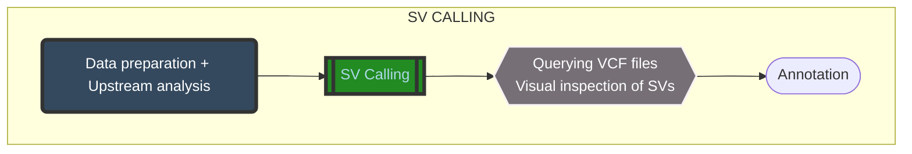

# STRUCTURAL VARIANT (SV) CALLING TUTORIAL FOR CLINICAL APPLICATION
---

## Table of contents
- [Calling Structural Variant (SV) and Clinical Application](#variant-annotation---gatk4-funcotator)
  - [Table of contents](#table-of-contents)
  - [Short Reads vs Long Reads technology](#short-reads-vs-long-reads-technology)
  - [Types of sequence variants found in a human genome](#types-of-sequence-variants-found-in-a-human-genome)
  - [Tools](#tools)
  - [Structural Variation Pipeline](#structural-variation-pipeline)
    - [1. Directory/Data preparation](#1-directorydata-preparation)
    - [2. Upstream analysis](#2-upstream-dna-analysis)
    - [3. Structural variant calling ](#3-structural-variant-calling)
    - [4. Querying VCF files](#4-querying-vcf-files)
    - [5. Visual inspection of SVs](#5-visual-inspection-of-svs)
    - [6. Annotation](#6-annotation)
  - [Appendix](#appendix)
  - [References](#reference)
  
## Short Reads vs Long Reads technology


Figure 1: Technologies that provide better variant detection deliver more explanations in rare disease research (PacBio 2023).


Figure 2: Short-reads and Long-reads technology (Blood 2023).

Short-read sequencing generates reads ranging from 50 to 350 bp in length, which might result in sequence gaps and insufficient coverage of disease-causing gene regions. Long-read sequencing generates reads that are tens of kilobases long, allowing for high-quality mapping throughout a genome and extensive variant identification.

## Types of sequence variants found in a human genome


Figure 3: Variation between two human genomes, by number of base pairs impacted (PacBio 2020).

Variants range in size from 1 bp (single nucleotide variant), to >50 bp for larger structural variants such as deletions, insertions, duplications, inversions translocations, and copy number variants.

## Tools
- Minimap2 to map short read (>100bp) and long reads (PacBio and Nanopore)
- GATK to pre-process data
- Samtools to manipulate BAM files
- Delly to call SVs using short/long reads
- Bcftools to manipulate VCF files with SV calls
- Samplot to visualise and inspect SVs
- SnpSift to annotate SVs

## Structural Variation Pipeline


Figuire 4: The process of SV Calling.

### **1. Directory/Data preparation**

#### 1.1 Setup working directory

```bash
# Create output directory
mkdir reference
mkdir raw_data
mkdir output
```
#### 1.2 Raw data information for short-reads technology 
Bioproject: PRJEB2793

Design: Whole Genome Sequencing of human

Submitted by: Genomic Medicine Institute, Medical Research Center, Seoul National University, Seoul, Korea

Study: Whole genome sequencing of a lung adenocarcinoma patient AK55.

Instrument: ILLUMINA (Illumina HiSeq 2000)

Published: 19/12/2011

Publications: Ju, Y. S., Lee, W. C., Shin, J. Y., Lee, S., Bleazard, T., Won, J. K., ... & Seo, J. S. (2012). A transforming KIF5B and RET gene fusion in lung adenocarcinoma revealed from 
whole-genome and transcriptome sequencing. Genome research, 22(3), 436-445.

Data access: https://www.ebi.ac.uk/ena/browser/view/PRJEB2793?show=publications

Normal (ERR059355) and cancer (ERR063457) samples had their DNA data pre-processed (upstream DNA analysis) and were mapped to chromosome 5 of whole GRCh38 reference genome. Please review prior CNV lectures to learn more about how they worked.

```bash
# Download raw data for BAM files of short reads
Downloading 
From: https://drive.google.com/uc?id=1T0aUdNBS-2NhmFe0ZPDzyIu0YxWheNLo
To: subset.sorted.normal.chr5.bam
Downloading
From: https://drive.google.com/uc?id=1taZrKPkRvsEZnpTunHFzELcQemLqJ04B
To: subset.sorted.cancer.chr5.bam
```

#### 1.3 Raw data information for long-reads technology
BioProject: PRJNA200694

Design: RNA sequencing of Homo sapiens B-Lymphocyte sample NIST HG005 NA24631

Submitted by: Baylor College of Medicine (BCM)

Study: A public-private-academic consortium, Genome-in-a-Bottle (GIAB), hosted by NIST to develop reference materials and standards for clinical sequencing.

Instrument: PACBIO_SMRT (Sequel II) 

Published: 02/12/2022

Data access: https://trace.ncbi.nlm.nih.gov/Traces/?view=run_browser&acc=SRR22508184&display=download

SRR22508184.HG005 was mapped to the whole GRCh38 reference genome, then duplicates were removed, and lastly the samples were converted to CRAM to reduce its size. 

```bash
# Download raw data for CRAM files of long reads
Downloading
From: https://drive.google.com/file/d/11Ycnf1lrDxzwmTV0OmEbcEbomq9URV2R
To: SRR22508184.HG005.PacBio.remove_dup.cram (1.51GB)
```

#### 1.4 Reference genome 

```bash
# Download reference file for Human genome GRCh38 
wget "https://hgdownload-test.gi.ucsc.edu/goldenPath/hg38/bigZips/analysisSet/hg38.analysisSet.fa.gz" -O reference/hg38.fa.gz
gzip -d reference/hg38.fa.gz
bgzip reference/hg38.fa
samtools faidx reference/hg38.fa.gz

# Download human genome GRCh38. Chromosome 5
wget "https://www.ncbi.nlm.nih.gov/sviewer/viewer.fcgi?db=nuccore&report=fasta&id=CM000667.2" -O hg38.chr5.fa.gz
gzip -d reference/hg38.chr5.fa.gz
bgzip reference/hg38.chr5.fa
samtools faidx reference/hg38.chr5.fa.gz
```

### **2. Upstream DNA analysis**
Minimap2 is a powerful sequence alignment application that can compare DNA or mRNA sequences to a huge reference library. Typical use cases include: (1) mapping PacBio or Oxford Nanopore genomic reads to the human genome; (2) finding overlaps between long reads with error rate up to ~15%; (3) splice-aware alignment of PacBio Iso-Seq or Nanopore cDNA or Direct RNA reads against a reference genome; (4) aligning Illumina single- or paired-end reads; (5) assembly-to-assembly alignment; (6) full-genome alignment between two closely related species with divergence below ~15%.

Minimap2 is 10x quicker than common long-read mappers such as BLASR, BWA-MEM, NGMLR, and GMAP for 10kb noisy read sequences. On simulated long reads, it is more accurate and generates physiologically relevant alignment suitable for downstream analysis. Minimap2 is 3x faster than BWA-MEM and Bowtie2 for >100bp Illumina short reads and twice (2x) as accurate on simulated data. The minimap2 articles or the preprint include detailed evaluations.

```bash
# Install Minimap2
git clone https://github.com/lh3/minimap2
cd minimap2 && make

# Or
conda install -c bioconda minimap2
```
#### Index reference genome before running minimap2
```bash
minimap2 -d reference/hg38.mmi reference/hg38.fa.gz
```

#### Map long reads
```bash
minimap2 -ax map-hifi --MD reference/hg38.mmi raw_data/SRR22508184.HG005.PacBio.trimmed.fastq.gz > raw_data/SRR22508184.HG005.PacBio.aln.sam
```
Explanation:
```bash
minimap2 -ax map-ont ref.mmi ont.fq.gz > aln.sam         # Oxford Nanopore genomic reads
minimap2 -ax map-hifi ref.mmi pacbio-ccs.fq.gz > aln.sam # PacBio HiFi/CCS genomic reads (v2.19 or later)
minimap2 -ax asm20 ref.mmi pacbio-ccs.fq.gz > aln.sam    # PacBio HiFi/CCS genomic reads (v2.18 or earlier)
minimap2 -ax sr ref.mmi read1.fa read2.fa > aln.sam      # short genomic paired-end reads
# man page for detailed command line options
man minimap2.1
```

#### Convert SAM to BAM
```bash
samtools view -Sb raw_data/SRR22508184.HG005.PacBio.aln.sam > raw_data/SRR22508184.HG005.PacBio.aln.bam
```

#### Sort the BAM file by coordinate
```bash
gatk SortSam \
--INPUT raw_data/SRR22508184.HG005.PacBio.aln.bam \
--OUTPUT raw_data/SRR22508184.HG005.PacBio.sorted.bam \
--SORT_ORDER coordinate
```

#### Remove duplicated reads
```bash
gatk MarkDuplicates \
--INPUT raw_data/SRR22508184.HG005.PacBio.sorted.bam \
--OUTPUT raw_data/SRR22508184.HG005.PacBio.remove_dup.bam \
--METRICS_FILE raw_data/SRR22508184.HG005.PacBio.remove_dup.metrics2 \
--OPTICAL_DUPLICATE_PIXEL_DISTANCE 2500 \
--CREATE_INDEX true \
--REMOVE_DUPLICATES true
```

### **3. Structural variant calling**
Delly is an integrated structural variation (SV) prediction approach that can detect, genotype, and visualize deletions, tandem duplications, inversions, and translocations in short-read and long-read massively parallel sequencing data at single-nucleotide resolution. It detects and delineates genomic rearrangements throughout the genome using paired-ends, split-reads, and read-depth.
```bash
# Install Delly
git clone --recursive https://github.com/dellytools/delly.git
cd delly/
make all

# Or
conda install -c bioconda delly

# Download the exclusion file containing genomic regions to be excluded from analysis, such as repetitive or problematic regions.
wget "https://github.com/dellytools/delly/blob/c65628b8ce83db90c180fa0ce6b52a5debac6926/excludeTemplates/human.hg38.excl.tsv" -O reference/human.hg38.excl.tsv
```

#### 3.1 SV calling for long reads
```bash
samtools index raw_data/SRR22508184.HG005.PacBio.remove_dup.cram

delly lr -y pb -g reference/hg38.fa.gz -o output/sv_longread.bcf raw_data/SRR22508184.HG005.PacBio.remove_dup.cram
```
Explanation:
```bash
delly lr -y ont -g hg38.fa -o delly.bcf input.bam # Oxford Nanopore genomic reads

delly lr -y pb -g hg38.fa -o delly.bcf input.bam # PacBio HiFi/CCS genomic reads
```
*Note*:
Filtering of called SV is also affected by the specific circumstance of the sample presented. We may use bcftools to filter the vcf files based on allele frequency, SV length, and SVs with the number of supporting reads to remove typically erroneous variations.

#### 3.2 Somatic SV calling
```bash
samtools index raw_data/subset.sorted.normal.chr5.bam

samtools index raw_data/subset.sorted.cancer.chr5.bam

delly call -q 20 -x reference/human.hg38.excl.tsv -g reference/hg38.chr5.fa.gz -o output/sv_somatic.bcf raw_data/subset.sorted.cancer.chr5.bam raw_data/subset.sorted.normal.chr5.bam
```
Explanation:
- `-q 20` : only reads with a mapping quality of at least 20 will be considered for variant calling.
- `-g fasta`: the reference genome file
- `-x reference.excl`: indicates the exclusion file containing genomic regions to be excluded from analysis, such as repetitive or problematic regions.
- `-o sv.bcf`: output BCF/VCF file
- `tumor.bam` 
- `control.bam`

*Note*:
Filtering of called SV is also affected by the specific circumstance of the sample presented. We may use bcftools to filter the vcf files based on allele frequency, SV length, and SVs with the number of supporting reads to remove typically erroneous variations.

#### 3.3 Germline SV calling
```bash
delly call -q 20 -x reference/human.hg38.excl.tsv -g reference/hg38.chr5.fa.gz -o output/sv_germline.bcf raw_data/subset.sorted.cancer.chr5.bam
```
*Note*:
Filtering of called SV is also affected by the specific circumstance of the sample presented. We may use bcftools to filter the vcf files based on allele frequency, SV length, and SVs with the number of supporting reads to remove typically erroneous variations.

### **4. Querying VCF files**


Figure 5: An example of SV somatic calling results. 

Bcftools offers many possibilities to query and reformat SV calls. For instance, to output a table with the chromosome, start, end, identifier and genotype of each SV we can use:
```bash
bcftools query -f "%CHROM\t%POS\t%INFO/END\t%ID[\t%GT]\n" output/sv_somatic.bcf | head
```

```bash
bcftools view output/sv_somatic.bcf | grep "^#" -A 2
```

Calculate the number of structural variations in the BCF file
```bash
bcftools view -H output/sv_somatic.bcf | column -t | less -S

bcftools view -H output/sv_somatic.bcf | awk '{print $8}' | wc -l

bcftools view -H output/sv_longread.bcf | awk '{print $3}' | wc -l
```

Calculate the number of Deletion (DEL), Duplication (DUP), Inversion (INV), Translocation (BND), Insertion (INS)  
```bash
bcftools view -H output/sv_somatic.bcf | awk '{print $5}' | sort | uniq -c

bcftools view -H output/sv_somatic.bcf | awk '{print $3}' | grep -o "^DEL" | wc -l

bcftools view -H output/sv_somatic.bcf | awk '{print $3}' | grep -o "^DUP" | wc -l

bcftools view -H output/sv_somatic.bcf | awk '{print $3}' | grep -o "^INV" | wc -l

bcftools view -H output/sv_somatic.bcf | awk '{print $3}' | grep -o "^BND" | wc -l

bcftools view -H output/sv_somatic.bcf | awk '{print $3}' | grep -o "^INS" | wc -l 
```

### **5. Visual inspection of SVs**
IGV is great for interactive browsing, but for huge numbers of SVs, command-line programs like Samplot can plot many SVs in batch. Samplot is a bioconda package that can be installed using the conda package management. https://github.com/ryanlayer/samplot

```bash
# Install Samplot
conda create --name samplot # To avoid conflicts with existing packages, create a new Conda environment.

conda activate samplot

conda install -c bioconda samplot 
```

```bash
samplot plot \
-n normal cancer HGOO5.PacBio \
-b raw_data/subset.sorted.normal.chr5.bam \
   raw_data/subset.sorted.cancer.chr5.bam\
   raw_data/SRR22508184.HG005.PacBio.remove_dup.cram \
-r reference/hg38.fa.gz \
-o output/region.png \
-c chr5 \
-s 33800000 \
-e 34800000 \
-t DEL
```
Explanation 
- `-n`: The name to be shown for each sample in the plot
- `-b`: BAM/CRAM files of the samples (space-delimited)
- `-r`: Reference fasta for CRAM (only CRAM files is required)
- `-o`: The name of the output file containing the plot
- `-c`: Chromosome of the region of interest
- `-s`: Start location of the region of interest
- `-e`: End location of the region of interest
- `-t`: Type of the variant of interest


Figure 6: Visualization of SVs of 3 samples (normal, cancer, SRR22508184.HG005.PacBio) in chromosome 5 (positions: 33800000 - 34800000).

### **6. Annotation**
SnpSift is a toolset for genetic variation annotation and functional impact prediction. It annotates and predicts the impact of genetic variations (such as amino acid alterations) on genes and proteins. https://pcingola.github.io/SnpEff/

```bash
# Install SnpSift 
# Go to home dir
cd

# Download latest version
wget https://snpeff.blob.core.windows.net/versions/snpEff_latest_core.zip

# Unzip file
unzip snpEff_latest_core.zip

# Download Clinvar databases
wget https://ftp.ncbi.nlm.nih.gov/pub/clinvar/vcf_GRCh38/clinvar.vcf.gz -O reference/hg38.clinvar.vcf.gz
gzip -d reference/hg38.clinvar.vcf.gz
bgzip reference/hg38.clinvar.vcf && tabix -p vcf reference/hg38.clinvar.vcf.gz
```

```bash
# Pre-process of BCF/VCF files
bcftools view output/sv_somatic.bcf > /dev/null # check errors
bcftools view output/sv_somatic.bcf > output/sv_somatic.vcf
```
 
```bash
# Annotate with SnpSift and Clinvar
java -jar "path/to/snpEff/SnpSift.jar" annotate reference/hg38.clinvar.vcf.gz output/sv_somatic.vcf > output/sv_somatic.clinvar.ann.vcf

gatk VariantsToTable -V output/sv_somatic.clinvar.ann.vcf -F CHROM -F POS -F TYPE -F ID -F ALLELEID -F CLNDN -F CLNSIG -F CLNSIGCONF -F CLNSIGINCL -F CLNVC -F GENEINFO -GF AD -GF GQ -GF GT -O output/sv_somatic.clinvar.ann.csv
```


Figure 7: Clinvar annotation of SRR22508184.HG005.PacBio from long-reads SV calling with the whole GRCh38 reference genome.

## **Appendix**
The findings saved in this appendix part are purely for reference purposes and are not intended to be exercise solutions. Because the DNA strands utilized in these tables were uncut and connected to the complete genome. The samples used in the exercise have been sliced to minimize size and make it easy to operate the machine without the need for strong configuration.

Table 1: Alignments outputs in GRCh38 reference genome.
| | GRCh38 | 
| :----: | :----: |
| normal | 237335190 / 237937983 |
| cancer | 207705616 / 209069025 | 
| SRR22508184.HG005.PacBio | 4321472 / 7562939 | 

*Notes*: * / ** means 

\* : The number of primary alignments, which are the best alignments for each read, based on alignment score and mapping quality.

** : The total number of reads in the file (only QC-passed).

Normal and cancer samples were mapped throughout the whole reference genome, not only chromosome 5, as the guidelines above suggest. 

Table 2: Short-reads outputs for Somatic SV calling in GRCh38 reference genome. 
| | GRCh38 | 
| :----: | :----: |
| Number of SVs | 19075 | 
| Deletion | 5879 | 
| Duplication | 635 | 
| Inversion | 1104 | 
| Translocation | 11368 | 
| Insertion | 89 | 

*Notes*: Normal and cancer samples were mapped throughout the whole reference genome, not only chromosome 5, as the guidelines above suggest. 

Table 3:  Long-reads outputs for SV calling in GRCh38 reference genomes.
| | GRCh38 | 
| :----: | :----: | 
| Number of SVs | 23409 | 
| Deletion | 20441 |
| Duplication | 1176 | 
| Inversion | 103 | 
| Translocation | 1165 | 
| Insertion | 524 | 

## **Reference**

Belyeu, J. R., Chowdhury, M., Brown, J., Pedersen, B. S., Cormier, M. J., Quinlan, A. R., & Layer, R. M. (2021). Samplot: a platform for structural variant visual validation and automated filtering. *Genome biology, 22(1)*, 1-13. https://doi.org/10.1186/s13059-021-02380-5.

Blood, M. (2023). Understanding rare diseases: Why research matters. *Rare disease*. [online] PacBio. Available at https://www.pacb.com/blog/understanding-rare-diseases-why-research-matters/. [Accessed 9 Jun. 2023].

Cingolani, P., Patel, V. M., Coon, M., Nguyen, T., Land, S. J., Ruden, D. M., & Lu, X. (2012). Using Drosophila melanogaster as a model for genotoxic chemical mutational studies with a new program, SnpSift. *Frontiers in genetics, 3*, 35. https://doi.org/10.3389%2Ffgene.2012.00035.

Danecek, P., Bonfield, J. K., Liddle, J., Marshall, J., Ohan, V., Pollard, M. O., ... & Li, H. (2021). Twelve years of SAMtools and BCFtools. *Gigascience, 10(2)*, giab008. https://doi.org/10.1093/gigascience/giab008.

Li, H. (2018). Minimap2: pairwise alignment for nucleotide sequences. *Bioinformatics, 34(18)*, 3094-3100. https://doi.org/10.1093/bioinformatics/bty191.

PacBio. (2020). Review: How long-read sequencing is revealing unseen genomic variation. *Human Genetics Research*. [online] PacBio. Available at https://www.pacb.com/human-genetics-research/review-how-long-read-sequencing-is-revealing-unseen-genomic-variation/. [Accessed 9 Jun. 2023].

PacBio. (2021). Sequencing 101: Whole genome sequencing for rare diseases. *Sequencing 101*. [online] PacBio. Available at https://www.pacb.com/blog/sequencing-101-rare-diseases/. [Accessed 9 Jun. 2023].

Rausch, T., Zichner, T., Schlattl, A., Stütz, A. M., Benes, V., & Korbel, J. O. (2012). DELLY: structural variant discovery by integrated paired-end and split-read analysis. Bioinformatics, 28(18), i333-i339. https://doi.org/10.1093/bioinformatics/bts378.

Van der Auwera, G. A., & O'Connor, B. D. (2020). Genomics in the cloud: using Docker, GATK, and WDL in Terra. O'Reilly Media.


